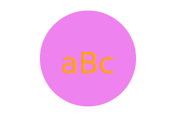

# Brand Logo Generator
A Node.js command-line application that takes in user input to generate a logo and save it as an SVG file. 

## Project Description
This application is to be run from the users terminal after following the install instructions. Once the user has started the program, they will be prompted to answer a series of questions. The answers to these questions will be used to generate a logo and save it as an SVG file. The user will be able to choose the color of the logo,  the shape of the logo, and the text that will be displayed on the logo. The user will then be generated an svg file named logo.sgv in a new directory in their project.

## User Story
```md
As a freelance web developer
I want to generate a simple logo for my projects
So that I don't have to pay a graphic designer
```
## Visuals
For a walk-through on how to use this program, or if you want to see it work before using it, please watch the following video: https://drive.google.com/file/d/13Cc869eAPstMSyZYhZ6hOX0KjatqxK7X/view

* Example of logo genereated by program:
* 
## Installation
* Node version 16 inquierer package 8.2.4
* To instal inquerier package use the following commands 
* To run tests, install [Jest](https://jestjs.io/) using npm
```
npm init -y
npm i inquirer@8.2.4
```
* Clone repository using GitHub
``` 
git clone https://github.com/jkrieger6/brand-logo-generator.git
```
* Made using the latest versions of Visual Studio Code
* Made with the latest version of GitHub

## License
* This application is covered under the [MIT](https://choosealicense.com/licenses/mit/) license
* [](https://opensource.org/licenses/MIT)

## Contributing
1. Fork the repository and clone it to your local machine.
2. Create a new branch for your feature or bug fix.
3. Make your changes and commit them to your branch.
4. Push your changes to your forked repository.
5. Open a pull request to the original repository, and describe your changes and why they are necessary.


## Support
* For support, the best form of contact will be by email at jkrieger11@gmail.com .

## Roadmap
* There are currently no future plans for this application. 
## Authors and acknowledgment
* Jake Krieger
[GitHub](https://github.com/jkrieger6?tab=repositories "GitHub Repos")

## Usage
* Start program to generate SVG file and create logo:
```
node index.js
```

